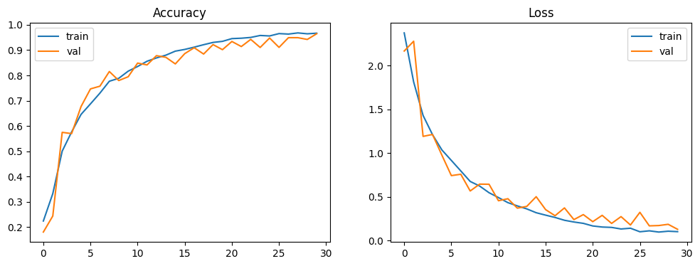
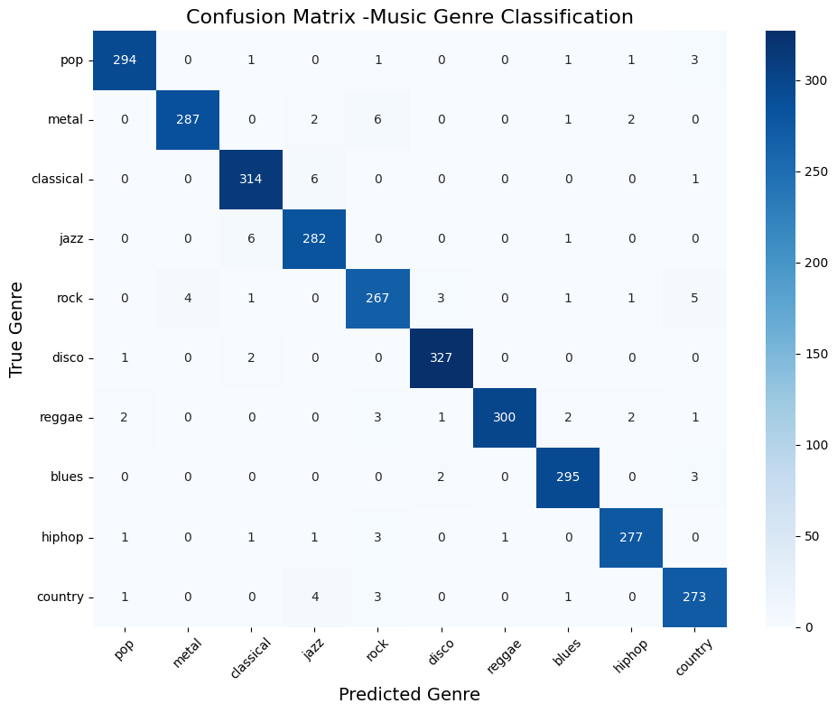

# 🎵 Music Genre Classification Project

## Overview

Music is an essential part of human culture, but automatically classifying songs into genres is a challenging problem for computers. With the explosion of digital music libraries, manual tagging is not scalable. This project aims to build an AI system that can accurately predict the genre of a given music clip. By leveraging deep learning, specifically **CNN** and **CRNN** models, we can extract both spatial and temporal features from audio spectrograms and classify songs into ten genres: pop, metal, classical, jazz, rock, disco, reggae, blues, hiphop, and country. This project demonstrates the full AI pipeline: from dataset collection and preprocessing to model training, deployment, and containerization.

---

## Dataset

We used the **GTZAN Music Genre Dataset**, which contains 1000 audio tracks, each 30 seconds long, distributed across 10 genres (100 clips per genre). The dataset provides a diverse set of music styles and is widely used for benchmarking music genre classification systems.

- **Number of samples:** 1000  
- **Genres:** pop, metal, classical, jazz, rock, disco, reggae, blues, hiphop, country  
- **Format:** WAV audio files, 22050 Hz sampling rate

---

## Preprocessing Techniques

Before feeding audio files to the models, several preprocessing steps were applied:

1. **Loading audio files** using `librosa`.
2. **Chunking audio clips** into overlapping segments (4 seconds long, 2 seconds overlap) to increase dataset size and handle long audio sequences.
3. **Converting to Mel Spectrograms** to extract meaningful frequency features.
4. **Resizing spectrograms** for CNN input (150x150 for CNN, original shape for CRNN).
5. **Normalization and reshaping** to match model input dimensions.

These preprocessing steps help the model capture both temporal and spectral patterns in the audio signals.

---

## Model Experiments

We trained multiple deep learning models:

1. **CNN Models**
   - Standard 2D Convolutional layers with pooling and dropout.
   - Experimented with different filter sizes and number of layers.

2. **CRNN Model**
   - CNN layers to extract spatial features from spectrograms.
   - Bidirectional LSTM layers to capture temporal dependencies.
   - Attention mechanism added to focus on important parts of the audio.

### Best Performance

- **CNN Accuracy:** 97% on the validation set
- **CRNN Accuracy:** Slightly better temporal understanding, used for further experimentation

---

### Accuracy (97%) and Loss


### Confusion Matrix


## Saving the Model

The best performing CNN model was saved as:

```bash
model.save('model.keras')
```

This saved model can be loaded directly in Python using:

```bash
import tensorflow as tf
model = tf.keras.models.load_model('model_music.keras')
```
## Blog Post

A detailed step-by-step blog explaining the project, preprocessing, experiments, and deployment was published on Medium:

[Read the Medium Blog](https://medium.com/@frextarr.552/music-genre-classification-using-cnn-and-crnn-on-gtzan-dataset-2d6607a35c15)


## FastAPI Deployment

We built a FastAPI backend for model inference:

- Accepts audio uploads via /predict_genre/

- Returns predicted genre with confidence scores

- Integrated with HTML frontend for user interaction

```bash
uvicorn app:app --reload
```

## Frontend

Simple HTML + CSS + JavaScript interface

- Allows users to upload audio files and see predictions instantly

- Responsive and lightweight

## Docker Image

To simplify deployment, a Docker image was created:

```bash
FROM python:3.10.11-slim

WORKDIR /app

# Add required system packages
RUN apt-get update && apt-get install -y libsndfile1 ffmpeg && rm -rf /var/lib/apt/lists/*

COPY requirements.txt .

RUN pip install --upgrade pip
RUN pip install --no-cache-dir --default-timeout=200 tensorflow==2.20.0
RUN pip install --no-cache-dir --default-timeout=200 -r requirements.txt

COPY . .

EXPOSE 8000
CMD ["uvicorn", "app:app", "--host", "0.0.0.0", "--port", "8000"]
```

## Project Highlights

- End-to-end deep learning pipeline for music genre classification

- Model versioning & tracking with MLflow (optional)

- Dataset & model versioning with DVC (optional)

- FastAPI + Docker deployment

- Fully documented on Medium for readers and learners

## Future Work

- Deploy model on cloud platforms (Render, Hugging Face Spaces, etc.)

- Experiment with larger datasets and more genres

- Add real-time streaming audio classification